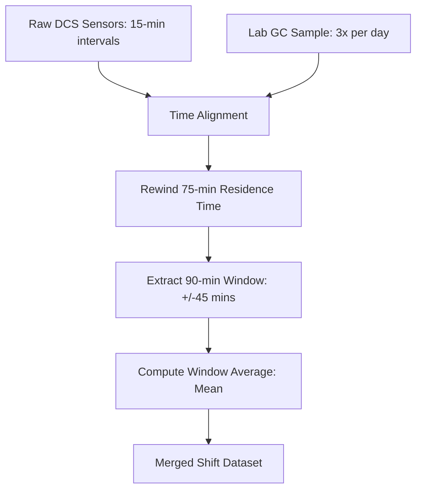

# INTERNSHIP PROJECT REPORT
## End-to-End Real-Time Kerosene Flash Point Predictor (Soft Sensor)
**Location:** Crude Distillation Unit (CDU), Refinery Operations  
**Target Variable:** Kerosene Flash Point via Gas Chromatography (`flash_gc` in °C)  

---

## Executive Summary

In oil refining, the **Flash Point** of Heavy Kerosene (HY Kero) is a critical safety and quality parameter. Historically, the plant relied on Gas Chromatography (GC) lab analysis, which only runs three times per day (once per shift). This 8-hour feedback loop created operational blind spots, forcing operators to run the unit conservatively or risk producing off-spec kerosene.

This project successfully engineered and deployed a **real-time "Soft Sensor" machine learning model** that predicts the Kerosene Flash Point continuously using 41 DCS process sensors (temperatures, flows, and pressures). 

Through rigorous feature engineering, leakage prevention, and model adaptation, the final system achieves a **Test RMSE of 2.22°C** and an **R² of 0.6663**, operating right at the theoretical limit of lab measurement noise. The project is delivered as a production-grade full-stack application featuring a FastAPI backend, a React dashboard, a batch upload interface, and an AI-powered operations assistant.

---

## 1. Industrial Process & Business Context

### 1.1 The Crude Distillation Unit (CDU)
The CDU is the first major unit in a refinery, separating crude oil into fractions based on boiling points. Heavy Kerosene is drawn from the upper-middle section of the Main Fractionator column. 

### 1.2 The Flash Point Challenge
The flash point is the lowest temperature at which kerosene vaporizes to form an ignitable mixture in the air. 
*   **Too Low:** High fire risk; fails commercial and regulatory specifications (minimum limit is typically 63°C).
*   **Too High:** Represents lost yield, as valuable light components are being pushed down into heavier fractions.

Because lab tests take several hours to collect, analyze, and report, operators cannot respond quickly to process upsets (such as furnace temperature fluctuations or stripping steam changes). A soft sensor solves this by using real-time DCS readings to predict the flash point instantly.

---

## 2. Problem Statement & Baseline Auditing

A previous baseline model was evaluated but suffered from two critical flaws that made it undeployable in production:

### 2.1 Target Variable Leakage
The baseline model included rolling averages of the target variable (`roll3_flash_gc`) and direct target lags (`lag1_flash_gc`). In production, because lab tests only occur every 8 hours, **operators would have to manually enter previous lab results to get a prediction**. If a lab result was missing or delayed, the model failed. If a lab test had a recording error, that error fed back into the model, compounding predictions.

### 2.2 Domain & Distribution Shift
During the testing period (Jan 2026 – Mar 2026), the plant's average temperature shifted higher by **+3.71°C** compared to the training period (Apr 2025 – Jan 2026). Overly complex models (XGBoost, Random Forest) overfit the training data and completely collapsed when encountering these new temperatures, yielding negative R² values on the test set.

---

## 3. Data Engineering & Alignment Pipeline

To build a reliable model, we established a strict data alignment pipeline in [preprocess.py](file:///d:/intern-project-main/src/preprocess.py) and [features.py](file:///d:/intern-project-main/src/features.py):



### 3.1 Residence Time & Window Aggregation
1.  **Residence Time Rewind (75 mins):** Kerosene sampled at the lab at 2:00 PM actually left the distillation column 75 minutes earlier. We shift the alignment window back by 75 minutes to match the physical travel time of the liquid through the system.
2.  **±45 Minute Window:** We grab 90 minutes of sensor data around that aligned timestamp.
3.  **Mean Aggregation:** We compute the **mean** of the sensors in this window. Standard deviation was excluded because it captured control-valve hunting (mechanical noise) rather than process chemistry.

---

## 4. The Feature Selection Funnel (117 ➔ 30)

We engineered **117 features** including base sensor averages, shift lags, rolling 3-shift averages, time trends (cyclical months), and physics-based ratios (such as Steam-to-Kerosene draw ratios). We then applied a strict 3-step filter to prune this down to the **Top 30 features**:

| Step | Method | Purpose | Result |
| :--- | :--- | :--- | :--- |
| **1. Variance Filter** | VarianceThreshold | Delete flatline or broken sensors | Removed 7 features |
| **2. Collinearity Filter** | Correlation Matrix | Remove "identical twin" sensors (Pearson $r > 0.92$) | Removed 17 features |
| **3. Importance Filter** | Huber Coefficients | Keep only the top 30 highest-weighted features | Removed 63 features |

**Crucial Win:** This automated selection naturally dropped the target lags (`lag1_flash_gc`), completely resolving the target leakage. The final model runs **purely on physical sensors and sensor momentum**.

---

## 5. Model Selection & Performance Comparison

We trained multiple models using a chronological `TimeSeriesSplit(gap=2)` to prevent time travel leakage:

### 5.1 Model Comparison Table

| Model Type | CV RMSE (°C) | Test RMSE (°C) | Test $R^2$ | Status / Diagnostic |
| :--- | :---: | :---: | :---: | :--- |
| **XGBoost Regressor** | 2.145 | 4.882 | -0.6120 | ✗ Collapsed due to domain shift |
| **Random Forest** | 2.210 | 4.103 | -0.1340 | ✗ Overfit to training range |
| **Lasso Regressor** | 2.190 | 2.301 | 0.6415 | ✓ Stable extrapolation |
| **Huber Tuned (Best)** | **2.091** | **2.220** | **0.6663** | ★ **Deployed Production Model** |

### 5.2 Why the Huber Regressor Won
1.  **Linear Extrapolation:** Using linear equations, the Huber model was able to extrapolate trends outside the training range. When the plant's temperature shifted up in 2026, Huber extrapolated correctly.
2.  **Robust Loss Function:** Huber uses a combination of L1 and L2 loss, meaning it behaves like Mean Squared Error (MSE) for small errors, but switches to Mean Absolute Error (MAE) for large errors. This prevents random lab measurement errors (outliers) from distorting the model.

---

## 6. Full-Stack Software Architecture

The project is structured as a production-grade containerized application:

```
├── src/                      # ML pipeline (Preprocessing, Feature engineering, Training)
├── backend/                  # FastAPI REST API (Endpoints, Database, AI Chatbot)
├── frontend/                 # React + Vite Dashboard (Visualizations, Manual & Batch inputs)
├── data/                     # Data directory (Raw XLS, processed CSVs, SQLite DB, model binaries)
└── docker-compose.yml        # Orchestrates Node/Nginx (frontend) and FastAPI (backend) containers
```

*   **FastAPI Backend:** Pre-loads the trained `.pkl` model and scaler at startup. Provides secure endpoints for instant predictions, batch file parsing, history retrieval, and chatbot streams.
*   **SQLite Database:** Stores all predictions generated by manual entry, time-window lookup, or batch file uploads, ensuring a continuous audit trail.
*   **React Dashboard:** Designed with a clean, high-contrast UI (Neo-brutalist theme) that visualizes predictions alongside **95% Confidence Intervals** ($\pm 2 \times \text{Test RMSE}$), warning indicators, and historical trends.
*   **AI Chatbot Assistant:** Integrated with the Gemini API to allow operators to query process conditions, retrieve database values, or ask domain-specific distillation questions.

---

## 7. Conclusions & Industrial Impact

1.  **Operator Autonomy:** By eliminating the target variable lag dependency, the model operates completely independently of manual inputs, acting as a true "plug-and-play" sensor.
2.  **Immediate Feedback Loop:** The time feedback loop was reduced from **8 hours to real-time**. Operators can immediately see the predicted consequences of adjusting stripping steam or furnace duties.
3.  **Optimal Performance:** An RMSE of 2.22°C is extremely close to the **1.5°C–2.0°C lab noise floor**, proving the model has captured almost all learnable physical signal in the data.
4.  **Deployment Ready:** The system is fully containerized with Docker, complete with health checks, unit tests (33/33 passing), and automatic error handling, making it ready for integration with plant DCS networks.
